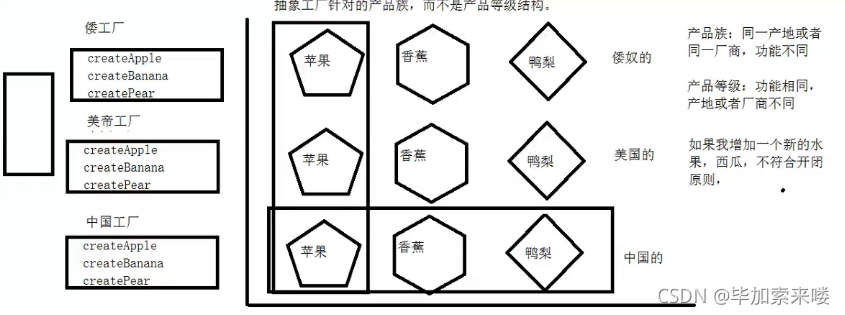

# 抽象工厂模式

## UML

## 抽象工厂的优缺点
### 优点：
    1. 拥有工厂方法模式的优点
    2. 当一个产品族中的多个对象被设计成一起工作时，它能够保证客户端始终只使用同一个产品族中的对象。
    3. 增加新的产品族很方便，无须修改已有系统，符合“开闭原则”。

### 缺点：
    1. 增加新的产品等级结构麻烦，需要对原有系统进行较大的修改，甚至需要修改抽象层代码，这显然会带来较大的不便，违背了“开闭原则”。

## 适用场景
    1. 系统中有多于一个的产品族。而每次只使用其中某一产品族。可以通过配置文件等方式来使得用户可以动态改变产品族，也可以很方便地增加新的产品族。
    2. 产品等级结构稳定。设计完成之后，不会向系统中增加新的产品等级结构或者删除已有的产品等级结构。
