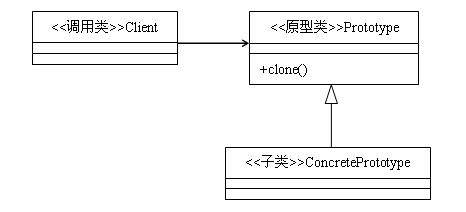

# 原型模式
## 什么是原型模式
        原型模式（Prototype Pattern），是一种创建型设计模式，指的是以原型实例指定待创建对象的种类，并通过拷贝（克隆）原型对象来创建新的对象。原型模式的核心和关键字是“对象拷贝”。
## 原型模式组成
        原型模式由抽象原型（Abstract Prototype ）、具体原型（Concrete Prototype ）、客户（Client） 三个要素组成。
    1. 抽象原型（Abstract Prototype ）, 声明一个抽象原型父类，定义自身实例拷贝接口
    2. 具体原型（Concrete Prototype ）， 继承Abstract Prototype 类，实现抽象接口，返回拷贝对象
    3. 客户（Client），客户调具体原型对象方法创建一个新的对象，严格来说客户不属于原型模式的一部分

## UML

## 原型模式作用
        原型模式的功能与拷贝构造函数一样，都是用于创建新对象。但原型模式可以动态获取当前对象运行时的状态。

## 原型模式优缺点
### 优点：
    1. 效率高、资源开销小
        使用原型模式创建对象比直接new一个对象效率要高，而且资源开销小，因为原型模式拷贝对象是一个本地方法过程，直接操作内存中的二进制流 。
    2. 使用便捷
        简化对象创建过程，隐藏拷贝细节，用户无需知道创建细节。
    3. 动态过程
        可以动态创建程序运行过程属性发生变化的对象，且创建的对象与运行对象互不干扰。
### 不足：
    1. 违背开闭原则
        原型模式需要为每一个类实现一个拷贝方法，由于拷贝方法在类内部实现，如需对类进行改造时，则需要修改原有代码（框架），违背了开闭原则。
    2. 增加系统复杂度
        在实现深拷贝时需要写较复杂的代码；如果对象之间存在多重嵌套引用，那么每一层对象对应的类必须支持深拷贝，才能实现深拷贝。
    3. 避开了构造函数的约束

## 什么地方使用原型模式
        原型模式的优点决定了其适用的场景，反过来其缺点即是其不适用的场景。原型模式适用场景：
    1. 资源优化
        待创建对象资源开销大（数据、内存资源），通过原型模式拷贝已有对象，降低资源开销，提高效率。
    2. 待创建对象类型不确定
        待创建对象类型没法静态确认，只能在执行期间确定。
    3. 对象副本
        程序运行过程，某个状态下需要一个对象副本；而对象属性有可能在运行过程改变，使用new来创建显然不适合。
    4. 简单对象处理
        处理一些比较简单的对象，对象直接区别小，只是某些属性不同；使用原型模式来获得对象省去重新new对象的资源开销，提高效率。
    5. 简化复杂的对象创建过程
        一个复杂的对象创建，构造函数需对各种参数初始化，用户需理解每一个参数的含义；使用原型模式直接拷贝一个对象，简化对象复杂的创建过程，减少开发者工作量。
    6. 对象被多个对象访问修改
        一个对象被其他多个对象访问，而且各个调用者可能都需要修改该对象，考虑使用原型模块拷贝出多个对象提供调用者访问。
    7. 解耦
        一个系统应该独立于它的产品创建、构成和表示时

## 原型模式实现
    大体步骤：
        1. 抽象原型父类Prototye声明对象拷贝（克隆）接口Clone，已经提供对象属性修改接口SetAddr和属性输出接口ShowAttr
        2. 具体原型ConcretePrototye实现抽象原型拷贝接口Clone
        3. 用户client调用具体原型对象拷贝接口Clone创建一个对象
